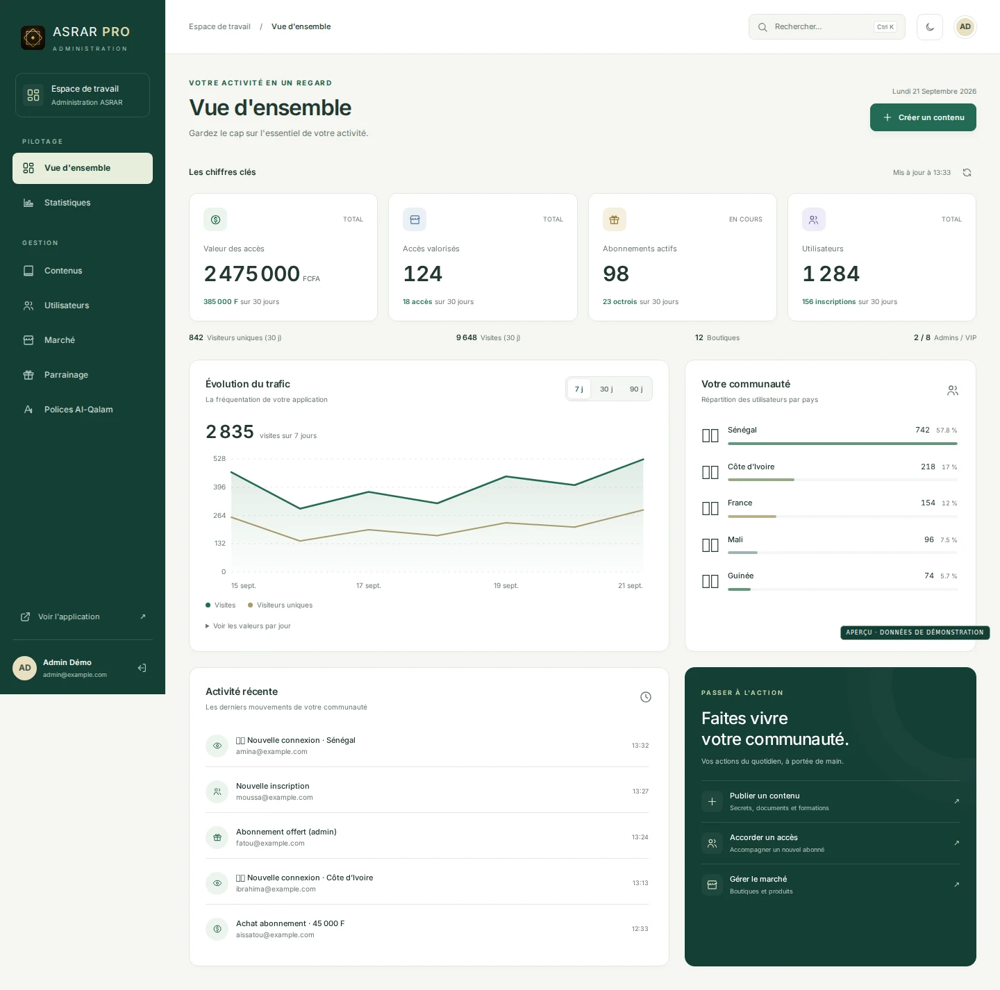
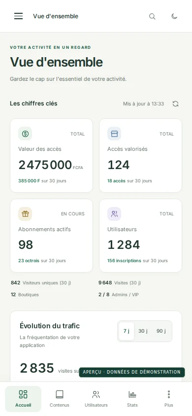
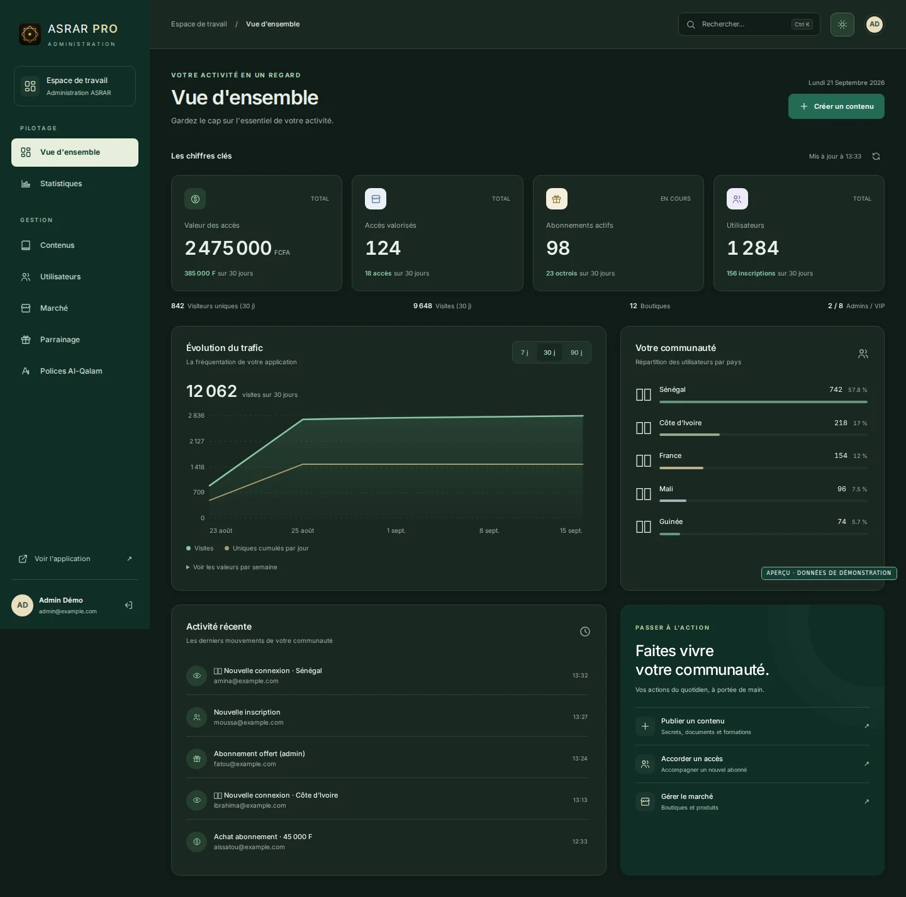
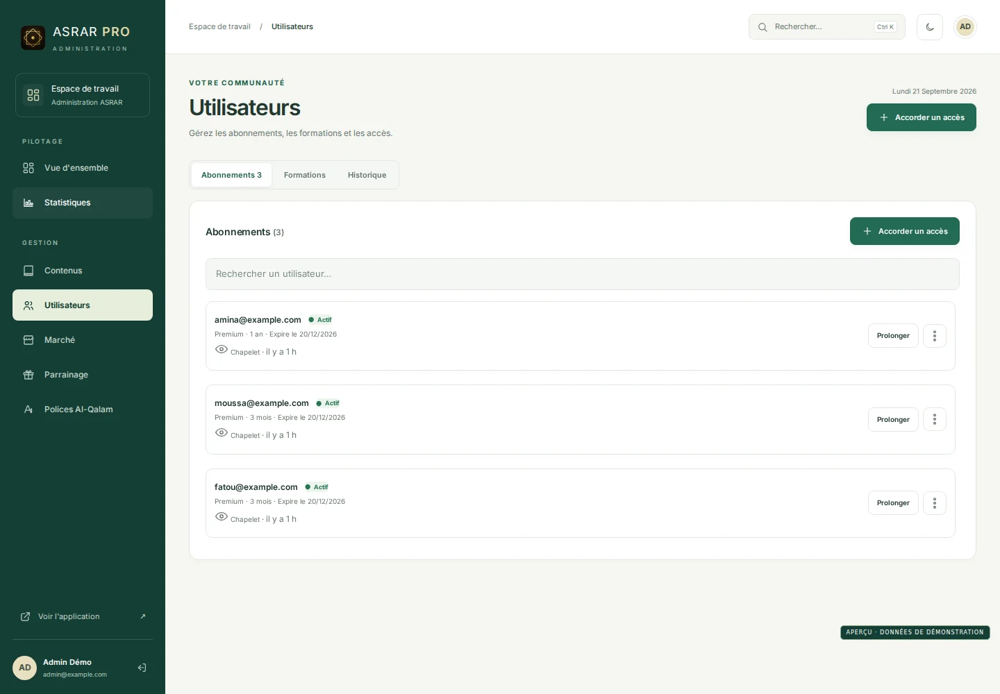
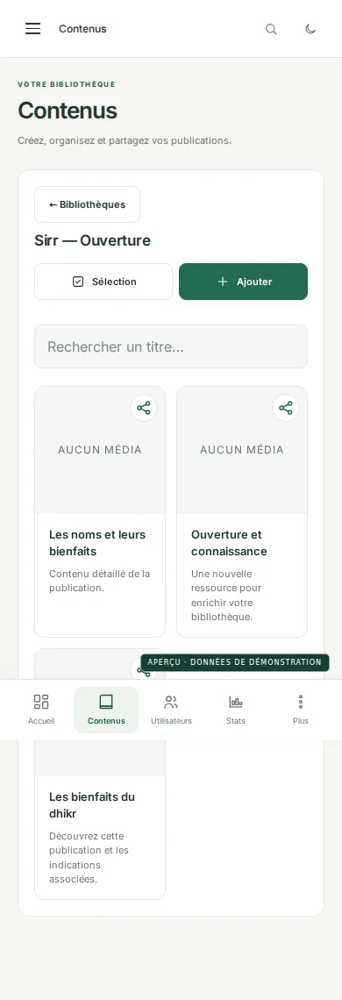

# Refonte de l'administration ASRAR PRO

L'interface partage désormais une identité ivoire et vert profond entre les
sept sections. Sur ordinateur, le menu reste à gauche ; sur mobile, les
sections courantes sont accessibles en bas de l'écran et « Plus » ouvre le
menu complet. La recherche clavier accélère les tâches récurrentes.
Le panneau inférieur de connexion récemment intégré dans `main` est conservé,
avec sa palette bleu nuit et son bouton Google.

## Aperçus

Les captures ci-dessous sont issues de l'interface réellement exécutée avec
les jeux de données fictifs des tests. Aucun compte ou chiffre de production
n'a été utilisé.

### Tableau de bord sur ordinateur

### Tableau de bord sur mobile

### Thème sombre

### Gestion des utilisateurs

### Contenus et connexion

## Vérification

- `npm run check` : 27 fichiers JavaScript vérifiés.
- `npm test` : trois scénarios de tests réussis dans Chromium.
- Sept sections parcourues à 360, 390, 768, 1024 et 1440 px, sans débordement horizontal de la page.
- Navigation mobile, recherche, retour navigateur, thèmes, fenêtres d'édition, focus clavier et déconnexion vérifiés.
- Données vides, compte refusé, stockage indisponible et relance après erreur vérifiés.
- Les réponses Firebase/API sont simulées par les tests ; aucune écriture de production n'est effectuée.

L'intégration réelle Google/Firebase et les envois Cloudinary restent à vérifier
sur une préproduction disposant des variables d'environnement du projet.
La structure des API, les droits serveur et les données existantes sont conservés.

## Repères de maintenance

Les styles du nouveau système se trouvent dans `admin-design.css` et les
interactions communes dans `admin-shell.js`. Les composants métier conservent
leurs identifiants et leurs gestionnaires existants. La version du service
worker passe à `admin-v26` et intègre les nouveaux fichiers ainsi que les
polices locales. La licence SIL Open Font License d'Inter est fournie avec
les polices.
